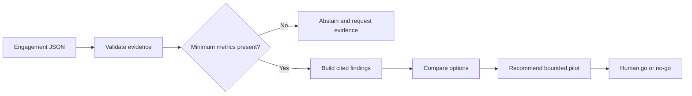

# AI Consulting Copilot

[](https://github.com/magicyao2028-pixel/ai-consulting-copilot/actions/workflows/ci.yml)
[](LICENSE)

> 中文介绍：这是一个面向中小企业 AI 转型场景的“证据驱动决策备忘录”原型。它把结构化业务证据整理为问题判断、备选方案、风险、建议和 30 天试点计划；每条关键结论都保留证据编号，未核实的供应商宣传不会进入推荐依据，关键数据缺失时会停止给出建议。公开版仅使用合成数据，不调用付费 API，也不声称已经产生真实经营效果。

**Live prototype:** https://magicyao2028-pixel.github.io/ai-consulting-copilot/

## Project context

This portfolio edition documents an AI-application and Agent-product practice explored in the business context of **Changsha Shiju Trading Co., Ltd.** It demonstrates how a transformation discussion can become a traceable decision workflow rather than an uncited AI-generated report. All public evidence is synthetic.

## Business problem

Small and medium-sized businesses often discuss AI pilots with incomplete baselines, vendor claims and unclear release gates. A polished report can still be unreliable when readers cannot trace a recommendation to its source. This v0.1 prototype therefore:

- validates an engagement and evidence register;
- separates verified, indicative and unverified evidence;
- checks three minimum business metrics before recommending a pilot;
- attaches evidence IDs to every finding, option, risk and recommendation;
- excludes unverified vendor claims from decision logic;
- abstains when required evidence is missing;
- produces a human-governed 30-day pilot memo in JSON and Markdown.

## What this repository demonstrates

| Capability | Evidence |
| --- | --- |
| AI product discovery | [PRD](docs/PRD.md), decision owner, constraints and release gate |
| Consulting workflow | Evidence intake -> quality gate -> findings -> options -> recommendation -> pilot plan |
| Grounded output | 100% claim-citation coverage in the synthetic reference case |
| Governance | Unverified-evidence exclusion, insufficient-evidence abstention and human approval |
| Engineering | Typed Python package, CLI, seven tests, CI and reproducible reports |
| Product communication | Zero-cost [browser case page](site/) and executive decision memo |

## Workflow



The current implementation is deterministic. It is an Agent-style application workflow because it coordinates evidence validation, quality gates, decision rules, citations and report generation; it is not presented as an autonomous consultant or an LLM.

## Quick start

Requirements: Python 3.10 or later. There is no third-party runtime dependency.

```bash
python -m pip install -e .
consulting-copilot data/sample_engagement.json
python -m unittest discover -s tests -v
```

Without installation:

```bash
PYTHONPATH=src python -m consulting_copilot.cli data/sample_engagement.json \
  --json-output examples/decision_memo.json \
  --markdown-output examples/decision_memo.md
```

## Reference case

The synthetic case asks whether a regional retailer should run an AI-assisted customer-service pilot. Three verified baseline metrics cross the declared thresholds, while a fourth verified item establishes a privacy risk. One vendor marketing claim is deliberately marked unverified and excluded. The result recommends a 30-day assistive pilot with human approval rather than autonomous replies.

The 100% citation figure means every generated claim object in this engineered sample has at least one evidence ID. It is not a claim that the recommendation is universally correct or validated in a real company.

## Honest boundaries

- Public evidence and business figures are synthetic.
- Rules and thresholds are illustrative, not universal consulting standards.
- Evidence reliability labels are supplied by the input and are not independently audited.
- The workflow does not search the web, interview staff or connect to company systems.
- It does not forecast ROI, approve spending or execute the pilot.
- There is no LLM, database, authentication, concurrent service or production deployment.

## Documentation

- [Product requirements](docs/PRD.md)
- [Architecture](docs/ARCHITECTURE.md)
- [Evidence method](docs/EVIDENCE_METHOD.md)
- [Security and governance](docs/SECURITY.md)
- [Maintenance plan](docs/MAINTENANCE_PLAN.md)
- [Current handoff](HANDOFF.md)
- [Changelog](CHANGELOG.md)

## Roadmap

- v0.1: evidence register, quality gate, cited memo, abstention and static case page;
- v0.2: contradiction detection and evidence freshness;
- v0.3: interview-note normalization and claim extraction review;
- v0.4: configurable decision thresholds and scenario comparison;
- v0.5: optional grounded model adapter behind citation validation;
- v1.0: controlled private pilot with authenticated reviewers.

## License

MIT License. See [LICENSE](LICENSE).
