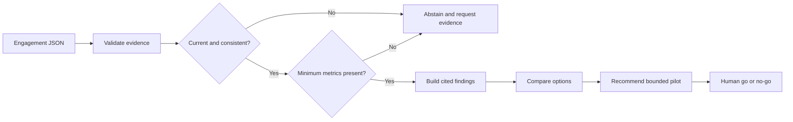

# AI Consulting Copilot

[](https://github.com/magicyao2028-pixel/ai-consulting-copilot/actions/workflows/ci.yml)
[](LICENSE)

> 中文介绍：这是一个面向中小企业 AI 转型场景的“证据驱动决策备忘录”原型。它把同一组受治理的结构化业务证据放入不同的显式阈值方案，展示建议是否随政策假设改变；未核实、过期、未来日期或互相冲突的证据不能被宽松阈值绕过。公开版仅使用合成数据，不调用付费 API，也不声称已经产生真实经营效果。

**Live prototype:** https://magicyao2028-pixel.github.io/ai-consulting-copilot/

## Project context

This portfolio edition documents an AI-application and Agent-product practice explored in the business context of **Changsha Shiju Trading Co., Ltd.** It demonstrates how a transformation discussion can become a traceable decision workflow rather than an uncited AI-generated report. All public evidence is synthetic.

## Business problem

Small and medium-sized businesses often discuss AI pilots with incomplete baselines, vendor claims and unclear release gates. A polished report can still be unreliable when readers cannot trace a recommendation to its source. This v0.5 prototype therefore:

- validates an engagement and evidence register;
- separates verified, indicative and unverified evidence;
- checks three minimum business metrics before recommending a pilot;
- attaches evidence IDs to every finding, option, risk and recommendation;
- excludes unverified vendor claims from decision logic;
- excludes stale and future-dated evidence using source-specific age limits;
- blocks recommendations when current metric values materially conflict;
- normalizes structured synthetic interview notes into candidate claims without treating them as evidence;
- requires an attributable human decision before an observation can enter the evidence register;
- validates named decision-threshold scenarios and compares them against one governed evidence register;
- reports whether a recommendation changes across scenarios without weakening any evidence gate;
- abstains when required evidence is missing;
- produces a human-governed 30-day pilot memo in JSON and Markdown.
- builds a machine-readable evidence-lineage graph and fails closed on unknown or decision-ineligible citations;
- exposes a clean offline trial and seven-claim evidence index.

## What this repository demonstrates

| Capability | Evidence |
| --- | --- |
| AI product discovery | [PRD](docs/PRD.md), decision owner, constraints and release gate |
| Consulting workflow | Evidence intake -> quality gate -> findings -> options -> recommendation -> pilot plan |
| Grounded output | 100% claim-citation coverage in the synthetic reference case |
| Governance | Claim-kind review, reliability, freshness, contradiction and insufficient-evidence gates |
| Engineering | Typed Python package, four CLIs, focused regression tests, CI and reproducible reports |
| Product communication | Zero-cost [browser case page](site/) and executive decision memo |
| Evidence lineage | Deterministic evidence-to-claim-to-decision graph with unknown/ineligible citation blocking |
| Trial readiness | [15–20 minute offline trial](docs/TRIAL_GUIDE.md), external screening and synthetic feedback regression |

## Workflow



The current implementation is deterministic. It is an Agent-style application workflow because it coordinates reliability, freshness, contradiction and completeness gates before decision rules, citations and report generation; it is not presented as an autonomous consultant or an LLM.

Interview intake follows a separate controlled path: `notes -> candidate claims -> human review -> approved observations -> evidence quality gates`. Normalization never promotes evidence automatically.

## Quick start

Requirements: Python 3.10 or later. There is no third-party runtime dependency.

```bash
python -m pip install -e .
consulting-copilot data/sample_engagement.json
consulting-interview-normalize data/sample_interview_notes.json --output examples/interview_candidates.json
consulting-claim-review examples/interview_candidates.json data/sample_claim_review.json --output examples/interview_review.json
consulting-scenario-compare data/sample_engagement.json data/sample_scenarios.json --output examples/scenario_comparison.json
consulting-lineage
consulting-trial
python -m unittest discover -s tests -v
```

Without installation:

```bash
PYTHONPATH=src python -m consulting_copilot.cli data/sample_engagement.json \
  --json-output examples/decision_memo.json \
  --markdown-output examples/decision_memo.md
```

## Reference case

The synthetic case asks whether a regional retailer should run an AI-assisted customer-service pilot. Three verified baseline metrics cross the declared thresholds, while a fourth verified item establishes a privacy risk. One vendor claim is unverified and one legacy internal record is stale; both remain visible in the register but are excluded from decision logic. The result recommends a 30-day assistive pilot with human approval rather than autonomous replies.

The 100% citation figure means every generated claim object in this engineered sample has at least one evidence ID. It is not a claim that the recommendation is universally correct or validated in a real company.

The synthetic interview fixture produces five candidate claims. A separate review fixture approves three observations, rejects one opinion and requests clarification on one research request. Approved records remain `indicative` and must still pass the same freshness and contradiction gates as every other evidence source.

The scenario fixture compares baseline, cautious and strict declared policies against the same source register. The first two support the bounded pilot while the strict policy does not, making sensitivity visible without pretending that any threshold is universally correct.

The [lineage report](examples/evidence_lineage.md) maps every generated claim to eligible evidence and connects cited recommendations to the executive decision. Unknown and stale/unverified citations fail closed. This proves declared traceability for one synthetic memo, not source truth or recommendation validity.

## Honest boundaries

- Public evidence and business figures are synthetic.
- Rules and thresholds are illustrative, not universal consulting standards.
- Scenario comparison is deterministic sensitivity analysis, not forecasting, optimization or proof of ROI.
- Evidence reliability labels are supplied by the input and are not independently audited.
- Freshness windows and the 10% contradiction tolerance are explicit prototype rules, not universal standards.
- The workflow does not record or transcribe interviews, search the web or connect to company systems; it accepts structured synthetic notes only.
- It does not forecast ROI, approve spending or execute the pilot.
- There is no LLM, database, authentication, concurrent service or production deployment.

## Documentation

- [Product requirements](docs/PRD.md)
- [Architecture](docs/ARCHITECTURE.md)
- [Evidence method](docs/EVIDENCE_METHOD.md)
- [Interview claim review](docs/INTERVIEW_CLAIM_REVIEW.md)
- [Scenario comparison](docs/SCENARIO_COMPARISON.md)
- [Security and governance](docs/SECURITY.md)
- [Maintenance plan](docs/MAINTENANCE_PLAN.md)
- [Trial guide](docs/TRIAL_GUIDE.md)
- [Current handoff](HANDOFF.md)
- [Changelog](CHANGELOG.md)

## Roadmap

- v0.1: evidence register, quality gate, cited memo, abstention and static case page;
- v0.2: contradiction detection and evidence freshness;
- v0.3: interview-note normalization and claim extraction review;
- v0.4: configurable decision thresholds and scenario comparison;
- v0.5: evidence lineage and trial-readiness package (current);
- v0.6: optional grounded model adapter behind citation validation;
- v1.0: controlled private pilot with authenticated reviewers.

## License

MIT License. See [LICENSE](LICENSE).
