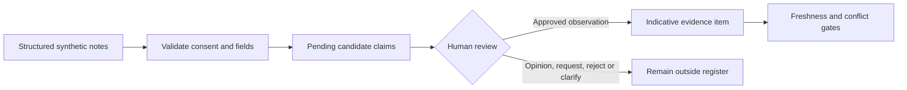

# Interview Claim Review

## Why it is a separate workflow

Interview notes mix observations, interpretations and requests. Treating every sentence as verified evidence would create false confidence. This prototype therefore produces two auditable artifacts instead of silently adding extracted text to a decision memo.

## Claim kinds

| Kind | Meaning | Can enter evidence register? |
| --- | --- | --- |
| `observation` | A specific statement about a current or past condition. | Only after explicit human approval. |
| `opinion` | A belief, expectation or interpretation. | No. |
| `request` | A proposed question, comparison or next action. | No. |

## Required review record

Every decision requires a candidate claim ID, reviewer ID, review date, decision and rationale. Approved observations are exported with source note and statement IDs. They receive `indicative`, not `verified`, reliability and remain subject to source freshness, metric contradiction and completeness controls.

## Public boundary

The repository contains structured synthetic notes only. It does not record, transcribe, summarize free-form real interviews, identify participants or connect to an HR or CRM system.
